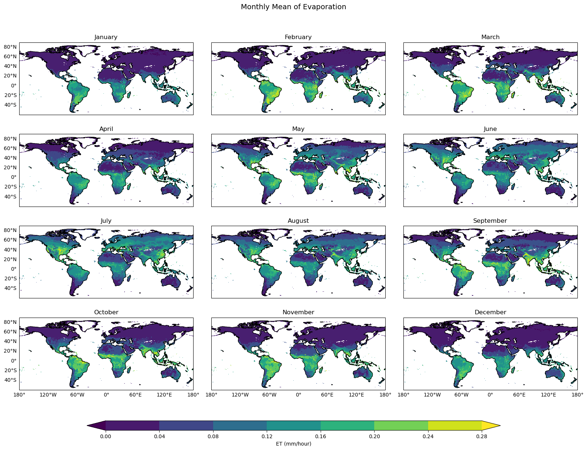
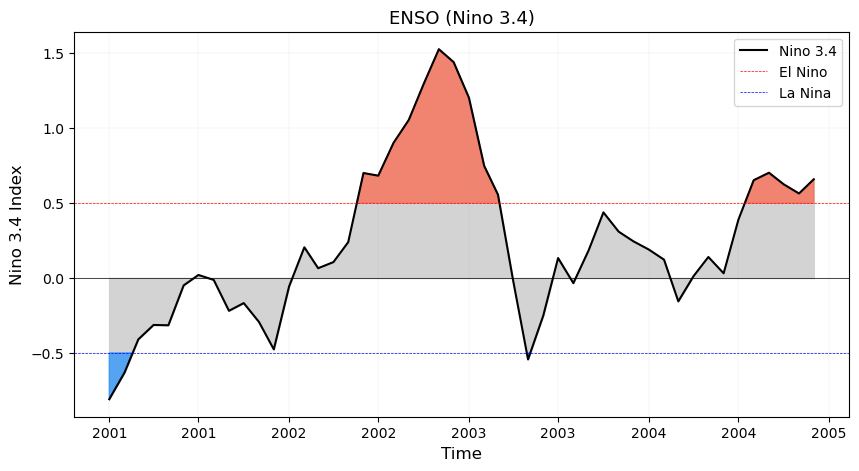
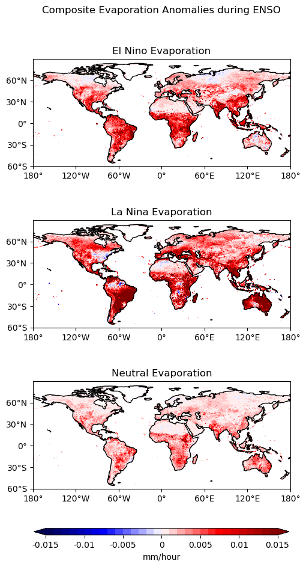
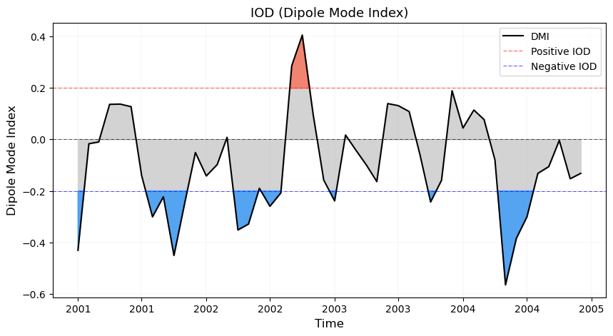
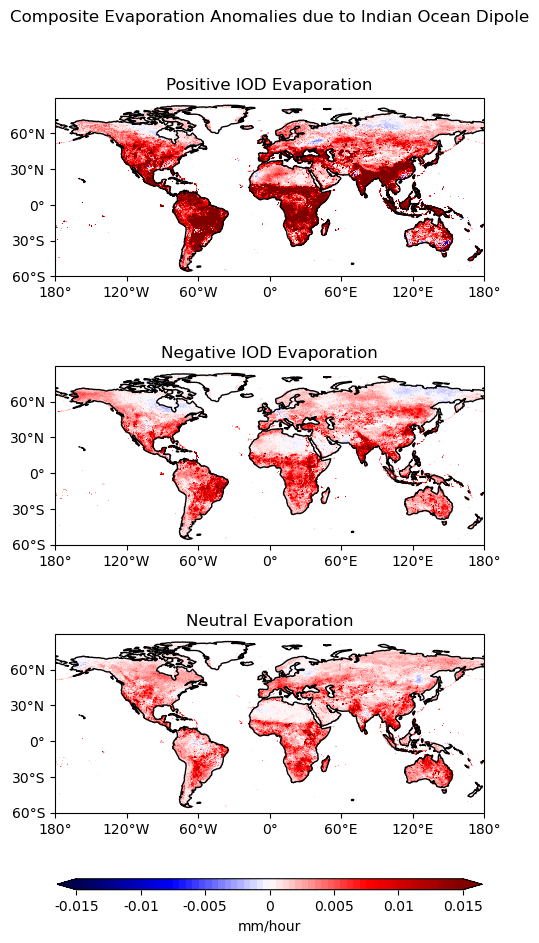
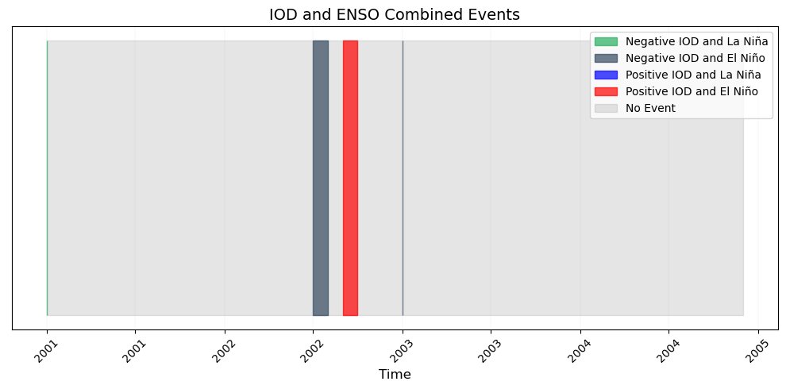
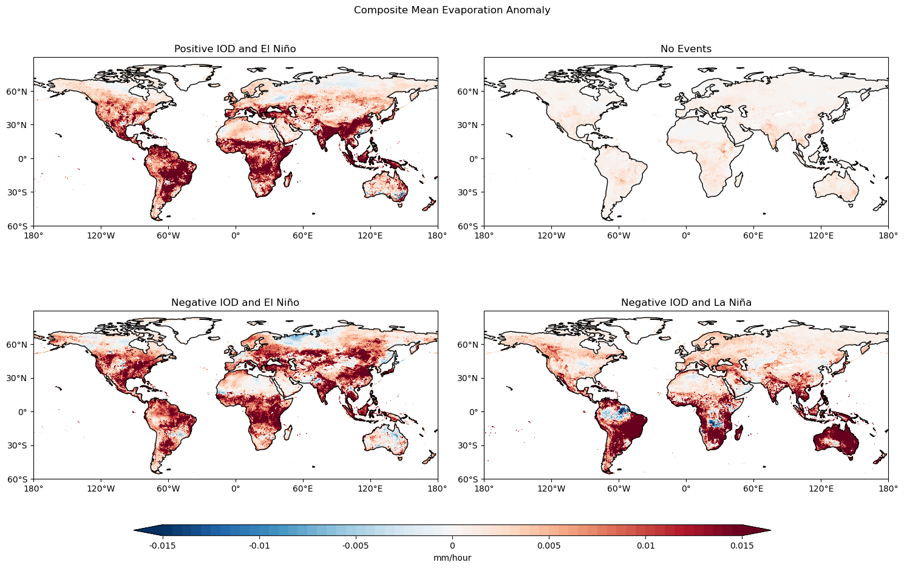
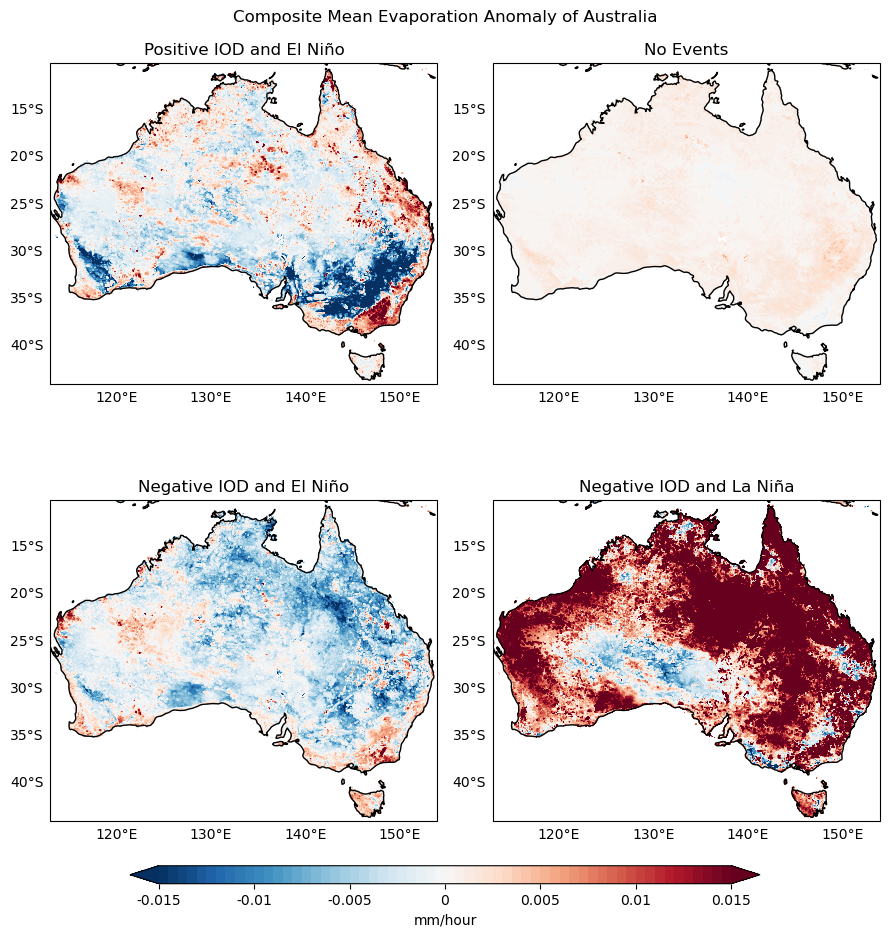
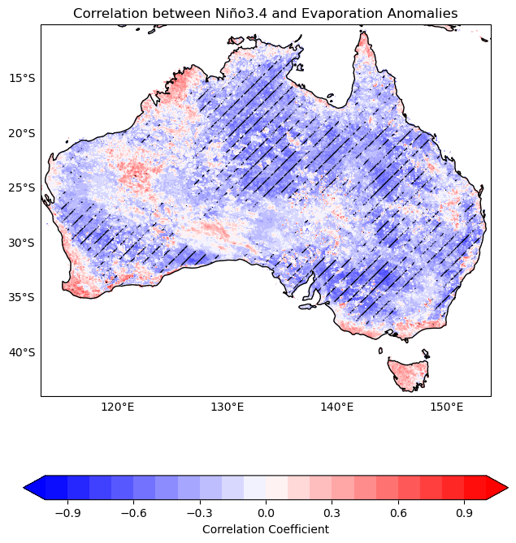

# **The Dual Drivers: How ENSO and IOD Modulate Global Evaporation Dynamics**
> **Author**: Tahmidul Azom Sany \
> **Course**: CLIM680 (Fall 2023) \
> **Affiliation**: PhD Student, Climate Dynamics, George Mason University  \
> **Contact**: [tsany@gmu.edu](mailto:tsany@gmu.edu)  

---
## Introduction
This study investigates the relationship between total evaporation and the dual influence of El Nino-Southern Oscillation (ENSO) and Indian Ocean Dipole (IOD) on global and regional scales. The dominant influence of ENSO on several climate variables is widely recognized. By combining the Indian Ocean Dipole (IOD), the phase change of the El Niño-Southern Oscillation (ENSO) can be accelerated, leading to the emergence of distinct global teleconnection patterns (Ham et al., 2017). The geographical locations of ENSO and IOD also overlap their effects in regions such as Australia, Indonesia, and certain parts of Africa. In this study, I quantified the individual and combined impacts of ENSO and IOD on global evaporation patterns. Also, I identified a region (Australia) most sensitive to these dual influences.

ENSO is the sea surface temperature (SST) anomaly in the central and equatorial Pacific Ocean. I used the Nino 3.4 index to identify El Nino, La Nina, and Neutral phases. According to NCEI, NOAA El Nino (La Nina) is a phenomenon in the equatorial Pacific Ocean where the SST anomalies in the Niño 3.4 region are consistently above (below) the threshold of +0.5°C (-0.5°C) for five consecutive 3-month periods. Whereas the IOD is the difference in SST between the equatorial western and eastern parts of the Indian Ocean. I used the Dipole Mode Index (DMI) to identify the Positive (DMI>0.2), Negative (DMI<0.2), and Neutral Phases of IOD. 

I chose the FLUXCOM xBase Dataset for its high spatial and temporal resolution, essential for accurately analyzing evaporation patterns influenced by the ENSO and the IOD. Its comprehensive global coverage is also crucial for examining the widespread impacts of these climatic phenomena. 

## Data

### Primary Dataset: Evaporation
To generate the FLUXCOM dataset, researchers from the Max Planck Institutes for Biogeochemistry used machine learning techniques; specifically the upscaling approach to combine in-situ observations, satellite remote sensing, and meteorological data. 
- **Source**: [FLUXCOM xBase Data](https://www.fluxcom.org/)
- **Spatial Resolution**: 0.05° x 0.05°
- **Temporal Resolution**: Daily data (12UTC) from `2001-01-01` to `2004-12-30` 
- **Variable**: Total Evaporation (mm/hour)

#### 💾 Zarr Format
"*Zarr is a format tailored for **chunked**, **compressed**, and **N-dimensional arrays**. It serves both as a storage and computational format to efficiently manage large datasets.*" More details can be found in the [official documentation](https://zarr.readthedocs.io/en/stable/).

#### 📂 Zarr Data Structure
Zarr employs a hierarchical storage model, similar to directories and files in a traditional file system:
- **Group**: The top-level container that can include other `groups` or `arrays`.
- **Array**: A N-dimensional chunked array within a `group`.
- **Metadata**: Stored in a human-readable JSON format.
- **Data Chunks**: Often compressed and stored as binary blobs.

### Climate Indices: NINO 3.4 
- **Source**: [NOAA Climate Prediction Center](https://www.cpc.ncep.noaa.gov/)
- **Spatial Coverage**: Central Equatorial Pacific, between 5°N - 5°S and 170°W - 120°W
- **Temporal Resolution**: Monthly averages
- **Variable**: SST anomalies (°C)

### Climate Indices: DMI 
- **Download Source**: [NOAA Physical Sciences Laboratory](https://psl.noaa.gov/gcos_wgsp/Timeseries/DMI/)
- **Spatial Coverage**: Western tropical Indian Ocean (50°E to 70°E and 10°S to 10°N) and Southeastern tropical Indian Ocean (90°E to 110°E and 10°S to 0°S)
- **Temporal Resolution**: Monthly averages
- **Variable**: SST anomalies (°C)

## Code Description

| Analysis | Description | Notebook |
|----------|-------------|---------------|
| ENSO and Evaporation | In this analysis, I analyzed only the effect of ENSO in Evaporation, by aggregating statistical analysis, anomalies, composite analysis, etc.| [View Notebook](https://example.com/climatologies_notebook) |
| IOD and Evaporation | In this analysis, I analyzed only the effect of IOD in Evaporation, by aggregating statistical analysis, anomalies, composite analysis, etc. | [View Notebook](https://example.com/climatologies_notebook) |
| Dual Influence of ENSO and IOD | I showed the dual influence of ENSO and IOD by calculating overlapping time and then showed composite analysis for Positive IOD and El Nino, No Events, Negative IOD and El Nino, Negative IOD and La Nina. As there is not timesteps where Positive IOD and La Lina occurs, it is not shown here. | [View Notebook](https://example.com/climatologies_notebook) |
| Effects of ENSO and IOD over Australia | Here, I showed the combined effect of ENSO and IOD over Australia where I performs temporal correlation coefficient, statistical significance etc. | [View Notebook](https://example.com/climatologies_notebook) |
| Solar Flux and Evaporation | In this analysis, I analyzed the effect of solar flux in Evaporation, there was no significant relationship found in the given timeline so in the main project I exclueded the solar flux | [View Notebook](https://github.com/tasanyphy01773/CLIM680/blob/main/Assignment03_680.ipynb) |
| Monthly Mean of Evaporation | This is a supporting notebook from assigment 02. Here I showed the Monthly mean of evaporation over 12 months for period 2001 to 2003| [View Notebook](https://github.com/tasanyphy01773/CLIM680/blob/main/Assignment02_680.ipynb) |
| Seasonal Changes of Evaporation | Here in the notebook refers to the assingment 01. I showed the seasonal changes of evaporation over period 2001 to 2003. Ingore the metadata like units. | [View Notebook](https://github.com/tasanyphy01773/CLIM680/blob/main/Assingment01_680.ipynb)

In my reports, I performed various analysis including aggregation of data for mean, standard deviation, calculating climatologies by month and seasons, and determining anomalies. I also conducted composite analysis with Nino 3.4 and DMI, created composite anomaly plots with statistical significance, and developed custom Python functions for specific data operations. Additionally, I calculated and plotted the temporal correlation coefficient between the gridded data and ENSO, providing insightful views into the evaporation and the dual driver climate patterns and relationships.

## Results
### Evaporation
We are now looking at the monthly mean evaporation from 2001 to 2003 (Figure 01). Each map uses a color gradient to indicate the rate of evaporation, with the scale provided at the bottom ranging from 0.00 to 0.28 millimeters per hour (mm/hour). Areas near the equator show a consistent presence of high evaporation rates throughout the year, likely due to higher temperatures and more intense sunlight. In contrast, the polar regions  indicates very low evaporation rates, which can be attributed to the cold temperatures and less sunlight

<figure style="text-align: center;">
    
    <figcaption>Figure 1: Monthly Mean Evaporation</figcaption>
</figure>

### ENSO and Evaporation 
Figure 02 shows the time when there was El Nino and when there was La Nina. As we are working with a very small time limit, the number of El Nino event (Nino 3.4 index>0.5) was 2 and around 2 La Nina. Where we have very few data from La Nina.
<figure style="text-align: center;">
    
    <figcaption>Figure 2: ENSO (Nino 3.4)</figcaption>
</figure>

In Figure 03, a composite analysis was conducted. In the El Nino and La Nina events, the evaporation increase from the climatological mean (2001 to 2004) is more prominent than in the Neutral phase, where the change is less; this could be because we have a lot of data from the neutral event, which might give us a wrong interpretation. 

<figure style="text-align: center;">
    
    <figcaption>Figure 3: Composite Evaporation Anomalies during ENSO </figcaption>
</figure>

### IOD and Evaporation 
The positive and negative phases of the IOD throughout that period are shown in Figure 04. Since the time period we are working with is short, there are only about 1 positive IOD and 6 negative IOD, with larger time of the Neutral IOD.

<figure style="text-align: center;">
    
    <figcaption>Figure 4: Indian Ocean Dipole (DMI)</figcaption>
</figure>

In Figure 05, a composite analysis during IOD is conducted. In the positive phase of the IOD, the increase in evaporation is more prominent than in the negative and neutral IOD. In contrast, there is seen some decrease in the evaporation for the negative IOD events. The response is more interesting in Australia. I will show the regional impact on Australia later. 

<figure style="text-align: center;">
    
    <figcaption>Figure 05: Composite Evaporation Anomalies during IOD</figcaption>
</figure>

### Dual influence of ENSO and IOD over Evaporation
Let us indulge in the dual influence of ENSO and IOD on a global scale. Figure 06 shows the combined period of ENSO and IOD. There are five distinct events: green for the Negative IOD and La Nina events, light black for the Negative IOD and El Lino events, blue for Positive IOD and La Nina, red for Positive IOD and El Nino, and white gray for No events. There are no Positive IOD and La Nina events, as the time range is too small. The Negative IOD and El Nino, and Positive IOD and El Nino events dominate the time range here, after no events.

<figure style="text-align: center;">
    
    <figcaption>Figure 06: ENSO IOD Combined events</figcaption>
</figure>

In Figure 07, the southern hemisphere shows a high response due to the combined effects of all the events. The most dominant increase was seen for the Negative IOD and La Nina event. The no-events period again shows less response as there is more data for the no-events period, which puts more weight on the mean over other occasions. But despite this problem, Australia shows an interesting pattern in response to all the events. Which make me to look into more regional scale of Australia. 

<figure style="text-align: center;">
    
    <figcaption>Figure 07: Composite mean evaporation anomaly for ENSO and IOD</figcaption>
</figure>

### Influence over Australia 
In Australia, we can see a more dominant evaporation increase due to the Negative IOD-La Nina events. At the same time, Negative IOD-El Nino events show a decrease in many areas. The no-events period was less responsive as usual.

<figure style="text-align: center;">
    
    <figcaption>Figure 08: Composite mean Evaporation anomaly of Australia</figcaption>
</figure>
In Figure 09, I delved into the correlation of evaporation with the Nino 3.4 index, and the statistical significance is also shown here for a p-value = 0.01. The negative correlation is more statistically significant than the positive correlation here. 

<figure style="text-align: center;">
    
    <figcaption>Figure 09: Correlation of Evaporation with ENSO with Statistical Significance</figcaption>
</figure>

## Summary
In summary, 

## Reference
- Ham, YG., Choi, JY. & Kug, JS. The weakening of the ENSO–Indian Ocean Dipole (IOD) coupling strength in recent decades. Clim Dyn 49, 249–261 (2017). https://doi.org/10.1007/s00382-016-3339-5

